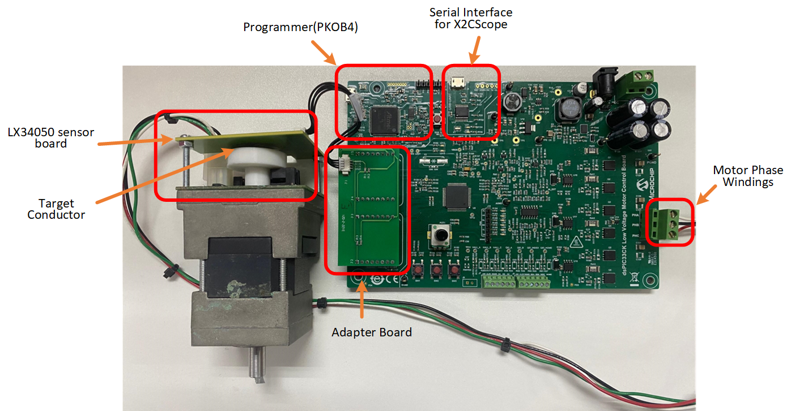
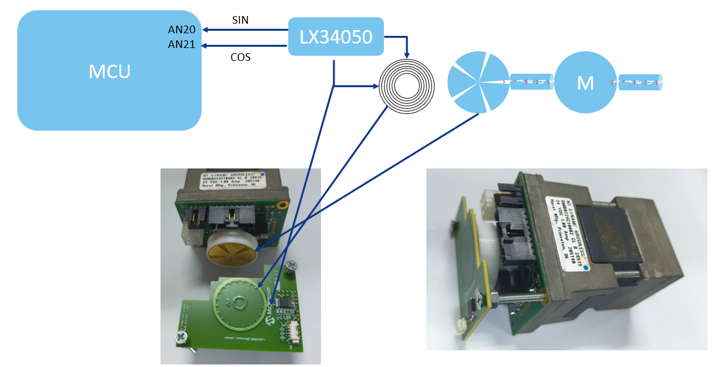
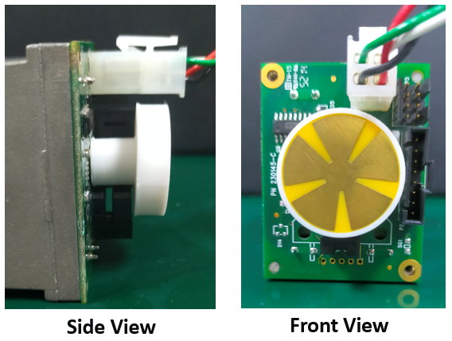
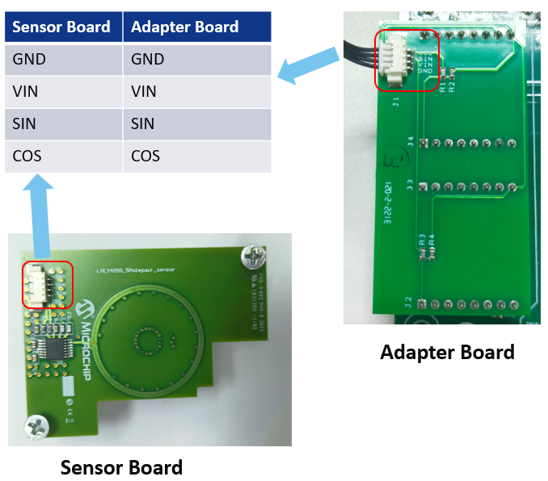
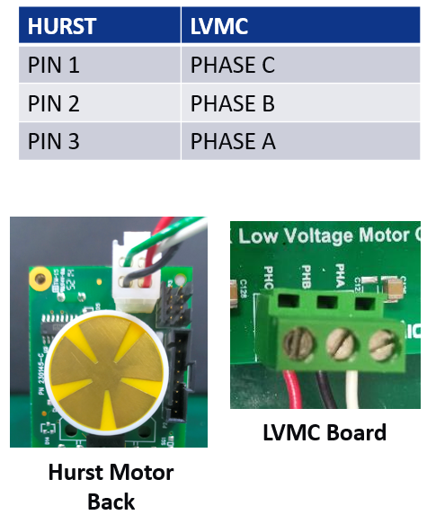

 

# LVMC dspic33CK256MP508 LX34050 FOC
 

## Summary
This document describes the use of the LX34050 inductive position sensor in providing an accurate rotor position for the FOC drive technique. There are two code versions included in this project: LX_LVMC_HURST_FOC_PLL.X uses the PLL estimator for determining all the offsets (sin, cos, and theta), while LX_LVMC_HURST_FOC_Manual.X uses the manual method for obtaining the offsets. Both MPLAB X projects use the same algorithm for calculating the theta from sin and cos signals, and measuring the speed. 

## Related Documentation
LX34050 Inductive Position Sensor-Based Field Oriented Control of Three-Phase BLDC Motor application note

## Software Used for Developing and Testing the Firmware
* MPLAB® X IDE v5.50
* MPLAB® XC16 Compiler v1.70
* MPLAB® X IDE Plugin: MPLAB® Code Configurator v5.0.3
* MPLAB® X IDE Plugin: X2CScope v.1.0.0
* DFP: dsPIC33CK-MP_DFP v1.8.224

## Hardware Used
* [DSPIC33CK LOW VOLTAGE MOTOR CONTROL (LVMC) DEVELOPMENT BOARD](https://www.microchip.com/en-us/development-tool/DM330031)
* LX34050 Static Sensor Board
* Adapter Board 
* Target Conductor

## Hardware Configuration
### Sensor Board Setup 
The diagram below illustrates the connection of the LX34050 Integrated circuit and the dsPIC signal controller while the images show the actual placement of the sensor board and target wheel on the hurst motor. 

### Placing the Target Wheel to the Shaft
1. Remove the back cover of the short hurst motor and attach the sensor wheel to the shaft as shown in the figure below.

2. Screw the sensor board and connect the phase winding wires and sensor wires.  
    

### LVMC Hardware Interface
* **LED11 for telling the direction of rotation.**
    - Lit up in Clockwise direction and turn off in counterclockwise. 
*	**LED10 for motor status**
    - Lit up when the motor is running and turn off when the motor is stopped
*	**SW1 for turning ON/OFF the motor**
*	**SW2 for reversing the direction of the motor.**
	- This switch button is designed to work only when the motor is stopped.  

## Firmware Configuration
Tuning or setting the offsets is the first thing that is recommended to be done before running the motor using the LX sensor as feedback. Refer to the LX34050 Inductive Position Sensor-Based Field Oriented Control of Three-Phase BLDC Motor application note for setting the offsets.

## Operation
Once all the offsets are determined, the system is ready to use the LX34050 sensor as feedback. The calibrated sine and cosine signals are fed to the atan(y/x) function, which calculates for the theta. The calculated theta is added with the theta offset to get the absolute rotor position. The speed is derived from several samples of the difference between subsequent rotor angle(θ) and applied with moving average filter to remove random noises. 

